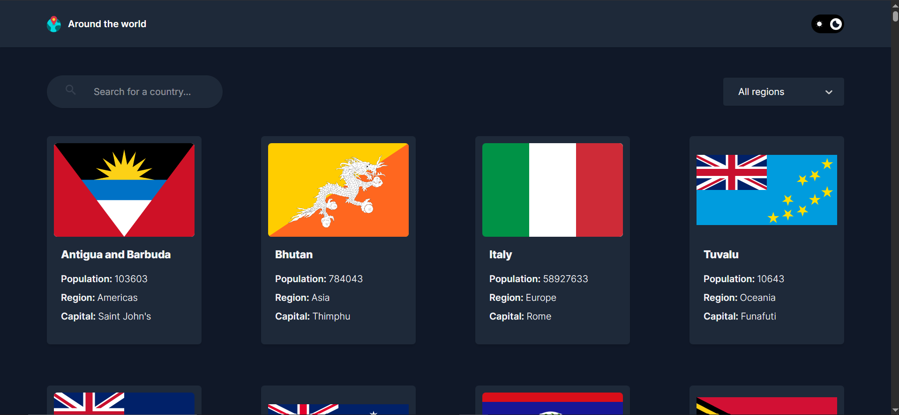

# 🌍 Around the World  
A simple, modern, and responsive web application built with **React**, **Vite**, and **TailwindCSS** that allows users to explore countries around the world.  
The app fetches real-time country details from the **REST Countries API**, displays detailed information, and supports **light/dark mode**.

---

## 🚀 Live Demo  
🔗 **https://karem-abdelkarem.github.io/around-the-world/**

---

## 📸 Preview  


---

## ✨ Features

- 🌍 **Browse all countries**  
  View a list of all countries with flags and basic info.

- 🔍 **Search functionality**  
  Find a specific country quickly.

- 📂 **Filter by region**  
  Select and view countries grouped by region.

- 📝 **Country details page**  
  Shows:
  - Population  
  - Region & Sub-region  
  - Capital  
  - Top-level domain  
  - Currencies  
  - Languages  
  - Flag  

- 🌓 **Dark & Light Theme**  
  Saves user preference in localStorage.

- ⚡ **Fast performance**  
  Powered by **Vite** + **React** + **TailwindCSS**.

- 📱 **Fully responsive**  
  Works smoothly on mobile, tablet, and desktop.

---

## 🛠️ Tech Stack

| Technology | Description |
|-----------|-------------|
| React | UI library |
| Vite | Build tool |
| TailwindCSS | Styling |
| React Router | Navigation |
| REST Countries API | Data source |
| React Select | Custom dropdown UI |

---

## 📦 Installation & Setup

1. **Clone the repository**
```bash
git clone https://github.com/Karem-Abdelkarem/around-the-world.git
Navigate into the folder

bash
Copy code
cd around-the-world
Install dependencies

bash
Copy code
npm install
Run the development server

bash
Copy code
npm run dev
🏗️ Build for production
bash
Copy code
npm run build
🚀 Deployment (GitHub Pages)
This project uses vite.config.js with:

js
Copy code
base: "/around-the-world/"
To deploy:

bash
Copy code
npm run deploy
GitHub Pages will publish from the gh-pages branch.

Live URL:

arduino
Copy code
https://karem-abdelkarem.github.io/around-the-world/
📁 Project Structure
css
Copy code
src/
 ├── components/
 ├── pages/
 │   ├── Home.jsx
 │   ├── Country.jsx
 │   ├── Layout.jsx
 │   └── ErrorPage.jsx
 ├── hooks/
 ├── utils/
 ├── App.jsx
 └── main.jsx
🌐 API Used
REST Countries API
🔗 https://restcountries.com/

🙋‍♂️ About the Developer
Created by Kareem Abdelkarem
Frontend Developer | React.js | TailwindCSS
🔗 GitHub: https://github.com/Karem-Abdelkarem
🔗 LinkedIn: (https://www.linkedin.com/in/kareem-mohamed-155304345/)

